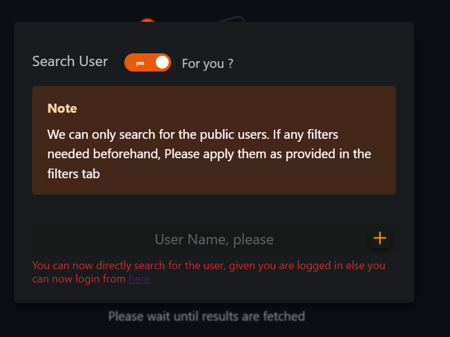

# Reports - Overview

This report generates the summary of the User's Animelist, which will clear some basic questions and display some general facts about the User's Animelist.



### Questions the report could answer

1. How many animes are there on the list?
2. How much time did the user spend overall (hrs/days)
3. How many animes does the user currently watching
4. How many animes are added to the list but are not yet aired
5. What Percent / How many animes are on the list set as Planned to watch, Currently on Hold, Dropped, or Completed?
6. How many Episodes did the user complete
7. What is the average score given by the user overall
8. What is the user's mainly added genre, studio?

<figure><figcaption>
Cards that answer above questions
</figcaption></figure>



<figure><figcaption>
Swiper Cards
</figcaption></figure>

1. What animes did the user add to his / her list which are Currently airing&#x20;
2. Oldest Anime
3. Most Recently Updated ones
4. Top Scoring Anime
5. Popular Anime
6. Anime with which users spent a long time with it


Only Top 10 Recently Updated animes are shown for the currently airing animes




****

**Data Source:** Requested [User Anime List](../../data-format/user-anime-list.md)
